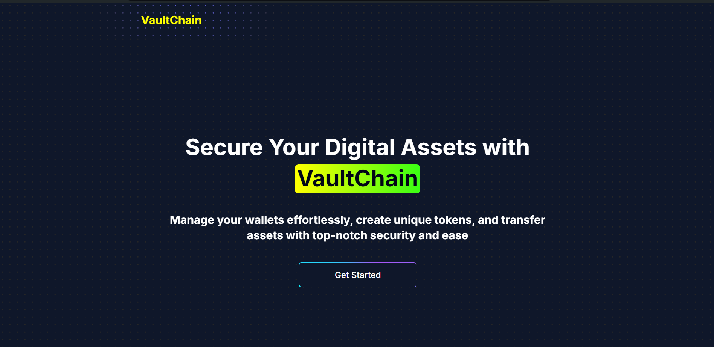

# VaultChain

VaultChain is a web-based cryptocurrency wallet supporting **Solana** and **Ethereum**. It allows users to create unique wallets from a single seed phrase, import existing wallets, airdrop tokens, and more. VaultChain makes it easy to manage your crypto assets across multiple blockchains with a clean and user-friendly interface.



## Features

- **Multi-Chain Support**: Supports wallets for Solana and Ethereum.
- **Create & Import Wallets**: Generate new wallets or import existing ones using a mnemonic phrase.
- **Send & Receive**: Transfer Solana, Ethereum, and SPL tokens securely.
- **Token Creation**: Create unique tokens with metadata like name, symbol, and image.
- **Airdrop**: Test airdrops for Solana.
- **Transaction History**: View transaction details and balances.
- **Security**: Password-protected local storage with bcrypt for password hashing.

## Demo

Check out the live demo [here](https://vaultchain.vercel.app/).

## Tech Stack

- **Frontend**: [Next.js](https://nextjs.org/), [React](https://reactjs.org/)
- **Blockchain**: Solana, Ethereum
- **State Management**: [Zustand](https://zustand-demo.pmnd.rs/)
- **Deployment**: [Vercel](https://vercel.com/)

## Installation

### Prerequisites

- Node.js >= 14
- npm or yarn

### Steps

1. Clone the repository:

   ```bash
   git clone https://github.com/your-username/vaultchain.git
   ```

2. Navigate to the project directory:

   ```bash
   cd vaultchain
   ```

3. Install dependencies:

   ```bash
   npm install
   ```

4. Set up environment variables by creating a `.env.local` file and add necessary keys for Solana and Ethereum networks.

5. Run the development server:

   ```bash
   npm run dev
   ```

6. Open your browser and navigate to `http://localhost:3000`.

## Environment Variables

Make sure to set the following environment variables in your `.env.local` file:

```
NEXT_PUBLIC_ETH_SEPOLIA_PROVIDER_URL="your provider url"
NEXT_PUBLIC_ETH_HOLESKY_PROVIDER_URL="your provider url"
NEXT_PUBLIC_ETH_MAINNET_PROVIDER_URL="your provider url"
NEXT_PUBLIC_ETH_MAINNET_PROVIDER2_URL="extra url"
NEXT_PUBLIC_SOL_MAINNET_PROVIDER_URL="your provider url"
```

<!--
## Folder Structure

```

``` -->

## Contributing

If you'd like to contribute to VaultChain, feel free to fork the repository and submit a pull request. We welcome contributions of all kinds, from bug fixes to new features.

<!-- ## License

This project is licensed under the MIT License - see the [LICENSE](LICENSE) file for details. -->

---
